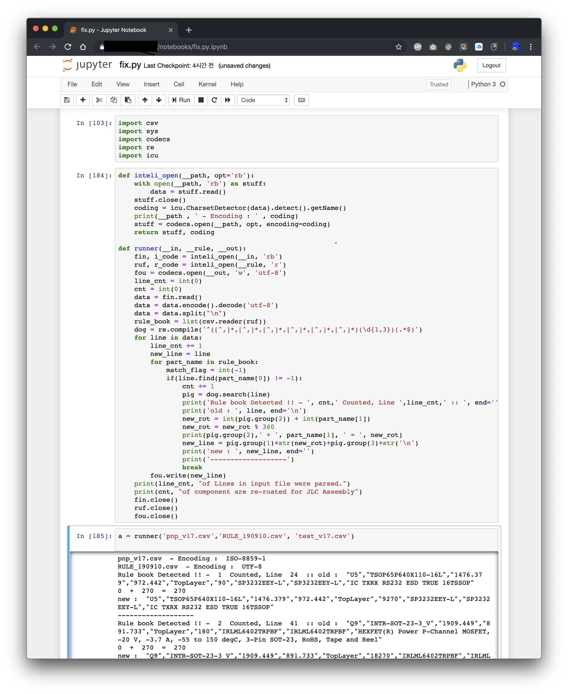

RotatorPnP
=====================
 Script that re-rotate specific parts' rotation value from Pick and Place CSV file with own rulebook.

This script rotate your parts by following your custom rule book.

About rulebook
------------------

Rule book is based on csv.
And you need to customize yourself.

There's two column for customize.

* First column is for find parts name that you want to change
* Second column is value how many degree you want to rotate. (csv value + your value = new value)

Why need this.
------------------

*I rotated value myself a month ago. that occured some mistake :(*

I made this for using JLCPCB assembly service.

My own footprint library isn't fit with their rule.

Details  of JLCPCB footprint standard issue from : http://club.szlcsc.com/article/details_12157_1.html

R/L/C was fine. But transistor , diode or ICs had issue about rotation value.

You may need to check how many value need to roate yourself. But it would be helpful than fix everyting by your hand and excel everytime.

Execution
------------------

Currently I didn't implemented about argument parsing. Need to fix "main()" yourself.

But I believe you are a engineer (since PCB artwork is engineer's era). and you can resolve easily.

Of course I will fix this later.

pyICU installation issue.
------------------
Install directly from here.
https://www.lfd.uci.edu/~gohlke/pythonlibs/#pyicu