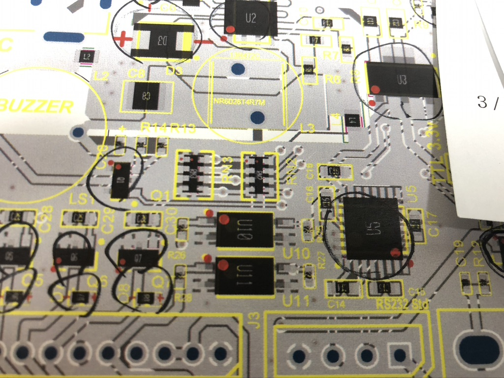

RotatorPnP
=====================
 Script that re-rotate specific parts' rotation value from Pick and Place CSV file with own rulebook.

```
 pmnxis@LambdaMBA  …/RotatorPnP   master ●  python3 ./rotatorpnp-kicad.py --default ./Sample_Kicad.csv                                                             SIGINT(2) ↵  2203  03:41:52
Use Default rulebook - rule_example.csv
Store to  ./Sample_Kicad-renew.csv
Rule book Detected !! -  1  Counted :: old :  "C9","100uF 35V","C_Elec_6.3x7.7",144.000000,-88.150000,270.000000,top
270  +  180  =  90
new :  "C9","100uF 35V","C_Elec_6.3x7.7",144.000000,-88.150000,90.000000,top
-------------------
Rule book Detected !! -  5  Counted :: old :  "U3","SP3232EEY-L","TSSOP-16_4.4x5mm_P0.65mm",138.750000,-74.250000,90.000000,top
90  +  270  =  0
new :  "U3","SP3232EEY-L","TSSOP-16_4.4x5mm_P0.65mm",138.750000,-74.250000,0.000000,top
-------------------
Rule book Detected !! -  6  Counted :: old :  "U4","74HC4049","SOIC-16_3.9x9.9mm_P1.27mm",68.500000,-74.250000,0.000000,top
0  +  270  =  270
new :  "U4","74HC4049","SOIC-16_3.9x9.9mm_P1.27mm",68.500000,-74.250000,270.000000,top
-------------------
Rule book Detected !! -  7  Counted :: old :  "U5","TM1638","SOIC-28W_7.5x17.9mm_P1.27mm",131.000000,-109.250000,0.000000,top
0  +  270  =  270
new :  "U5","TM1638","SOIC-28W_7.5x17.9mm_P1.27mm",131.000000,-109.250000,270.000000,top
-------------------
Rule book Detected !! -  8  Counted :: old :  "U6","DRV8840PWP","HTSSOP-28-1EP_4.4x9.7mm_P0.65mm_EP2.85x5.4mm_3D",67.250000,-90.000000,90.000000,top
90  +  270  =  0
new :  "U6","DRV8840PWP","HTSSOP-28-1EP_4.4x9.7mm_P0.65mm_EP2.85x5.4mm_3D",67.250000,-90.000000,0.000000,top
-------------------
Rule book Detected !! -  9  Counted :: old :  "U7","MB85RC16PNF-G","SOIC-8_3.9x4.9mm_P1.27mm",136.250000,-54.620000,180.000000,top
180  +  270  =  90
new :  "U7","MB85RC16PNF-G","SOIC-8_3.9x4.9mm_P1.27mm",136.250000,-54.620000,90.000000,top
-------------------
Rule book Detected !! -  10  Counted :: old :  "U8","ESP32-WROOM-32E (4MB)","ESP32-WROOM-32E",100.000000,-65.865000,0.000000,top
0  +  270  =  270
new :  "U8","ESP32-WROOM-32E (4MB)","ESP32-WROOM-32E",100.000000,-65.865000,270.000000,top
-------------------
29 of Lines in input file were parsed.
10 of component are re-roated for assembly factory
```
This script rotate your parts by following your custom rule book.

For now it's only maintained for kicad5 pos file.
Also this convert to JLCPCB format automatically when use kicad version.

About rulebook
------------------

Rule book is based on csv.
And you need to customize yourself.

There's two column for customize.

* First column is for find parts name that you want to change
* Second column is value how many degree you want to rotate. (csv value + your value = new value)


Why need this.
------------------


*I rotated value myself a month ago. that occured some mistake :(*

I made this for using JLCPCB assembly service.

My own footprint library isn't fit with their rule.

Details  of JLCPCB footprint standard issue from : http://club.szlcsc.com/article/details_12157_1.html

R/L/C was fine. But transistor , diode or ICs had issue about rotation value.

You may need to check how many value need to roate yourself. But it would be helpful than fix everyting by your hand and excel everytime.


Execution - Kicad
------------------
```shell
python3 ./rotatorpnp-kicad.py --default ./Sample_Kicad.csv
```

#### CommandLine Form
```
Rotator-Kicad :: Please follow commands.

Example - Quick (--default)
--default ./LambdaCoin-pos.csv
this will export result to ./LambdaCoin-pos-renew.csv that renew postfix.

Example - Manual
./input.csv ./ruleBook.csv ./output.csv
```

Execution - Previous Version (Orcad or altium)
------------------

Currently I didn't implemented about argument parsing. Need to fix "main()" yourself.

But I believe you are a engineer (since PCB artwork is engineer's era). and you can resolve easily.

Of course I will fix this later.

pyICU installation issue.
------------------
Install directly from here.
https://www.lfd.uci.edu/~gohlke/pythonlibs/#pyicu